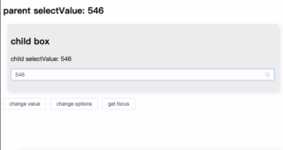
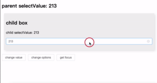

# vue3-blog-use-table-in-select-option

表单-下拉选择框-用表格展示。基于 el-select 组件的插槽，使用无序列表模拟表格。

博客：[优化表单交互：在 el-select 组件中嵌入表格显示选项](https://wu-kave.github.io/2024/optimizing-form-interactions-embedding-table-display-options-in-el-select-components.html)



支持全表格搜索



## 使用

下载并引入该项目下 `src/components/BaseTableSelect.vue` 文件。

一个简单演示：

- `options`：行数据
- `columnConfig`：列配置

`template` 结构和 `js` 部分如下：

```vue
<BaseTableSelect v-model="selectValue" :options="options" :columnConfig="columnConfig">
</BaseTableSelect>
```

```JavaScript
const options = ref([
  {id: "213", department: '古典风格号', createTime: '2024-12-23', place: '学校'},
  {id: "546", department: '都听好', createTime: '2024-12-23', place: '家里'},
  {id: "345", department: '按时到岗', createTime: '2024-12-23', place: '医院'}
])

const columnConfig = ref([
  {label: '单号', prop: 'id'},
  {label: '部门', prop: 'department'},
  {label: '时间', prop: 'createTime'},
  {label: '地点', prop: 'place'},
])

```

## 属性

| 参数         | 说明                            | 类型    | 默认值   |
| ------------ | ------------------------------- | ------- | -------- |
| disabled     | 是否禁用                        | boolean | false    |
| placeholder  | 请选择                          | string  | '请选择' |
| columnConfig | 列配置，[{label: '', prop: ''}] | array   | []       |
| options      | 选项                            | array   | []       |
| valueName    | 选项值的属性名                  | string  | 'id'     |
| keyName      | 遍历选项时的 `key`              | string  | ''       |
